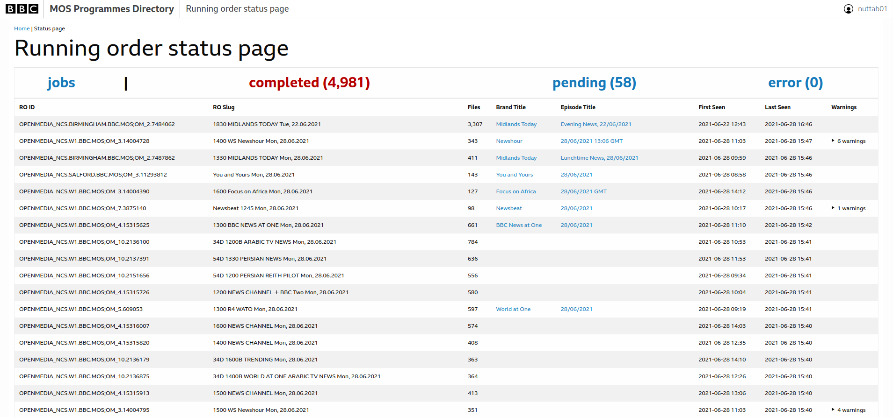
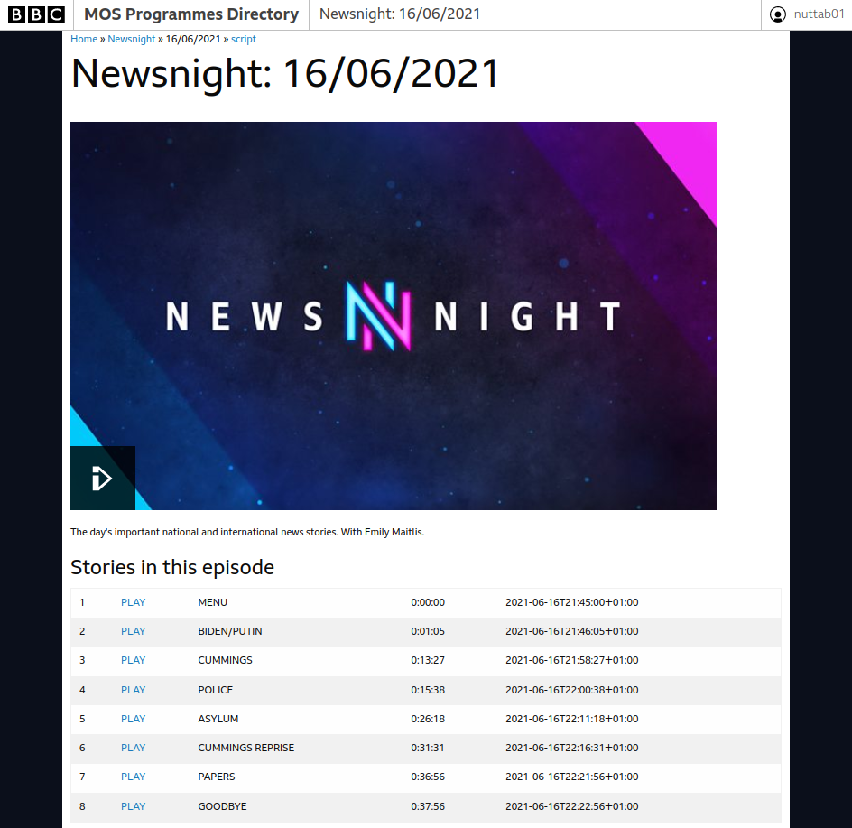
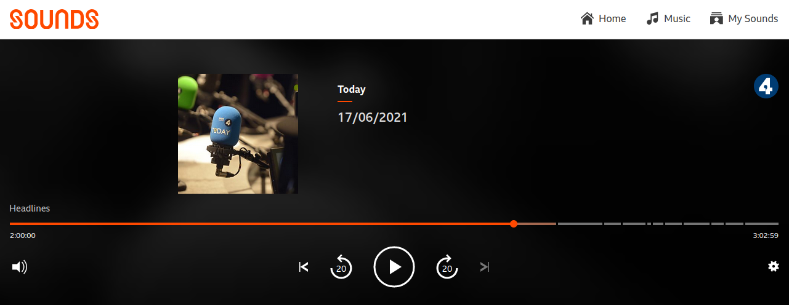

.. mosromgr: Python library for managing MOS running orders
.. Copyright 2021 BBC
.. SPDX-License-Identifier: Apache-2.0

================
Uses of mosromgr
================

This section lists projects which have been known to use the *mosromgr* module.
If you have used *mosromgr* in a project and would like to add it to the list,
please `edit this file`_ and open a pull request, `open an issue`_, or send an
email to bbcnewslabsteam@bbc.co.uk.

.. _edit this file: https://github.com/bbc/mosromgr/blob/main/docs/uses.rst
.. _open an issue: https://github.com/bbc/mosromgr/issues/new

BBC News Labs - MOS pipeline
============================

We have a collection of `AWS`_ services making up a pipeline which processes MOS
messages in real time, updates a status dashboard, publishes completed MOS
running orders and JSON summaries to an internal document store, and populates a
directory of programmes with new episodes and lists of stories (complete with
timing information) as they become available.

.. _AWS: https://aws.amazon.com/

Status dashboard:

Programmes directory:

Example chapterised breakdown of an episode of `Newsnight`_:

.. _Newsnight: https://www.bbc.co.uk/programmes/b006mk25

BBC News Labs - Auto chapterisation
===================================

We were able to decorate the player timeline with chapter points in certain BBC
TV and radio programmes:

We used the script and story timing information extracted from the running
order and aligned it against the transcript.

BBC News Labs - Live Segment Notifications
==========================================

We developed a proof-of-concept in which a note within a story in a running
order could trigger a tweet to alert people of an upcoming story in time to
watch live, or link to the clip of the story on-demand:

